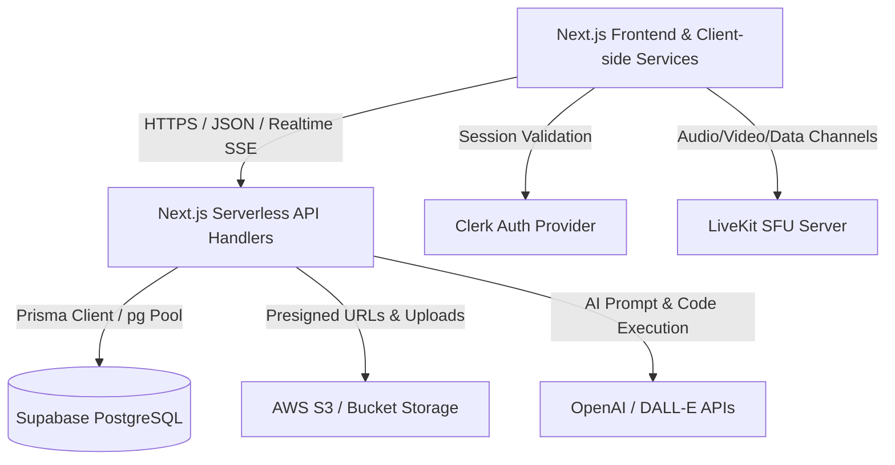
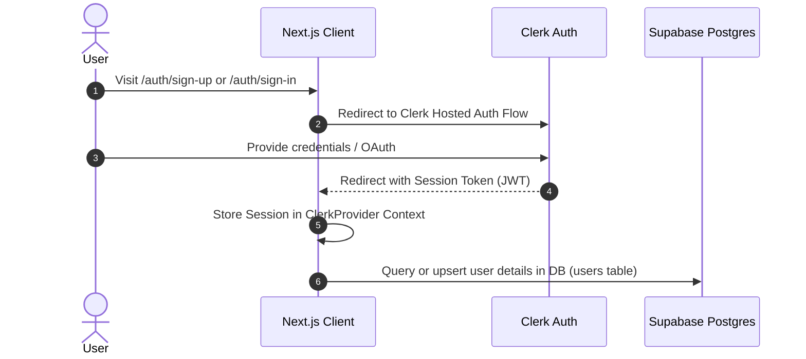
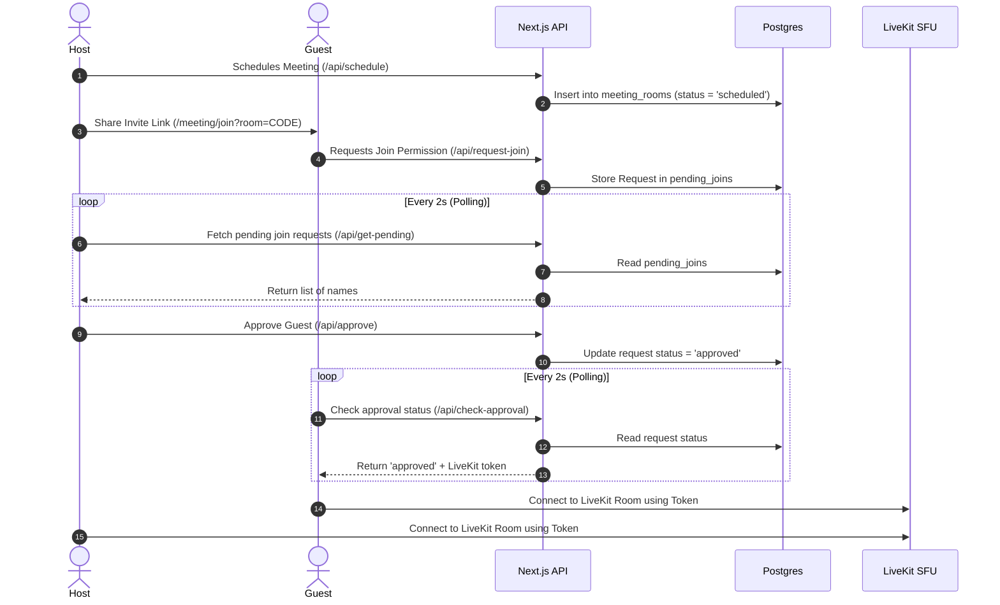
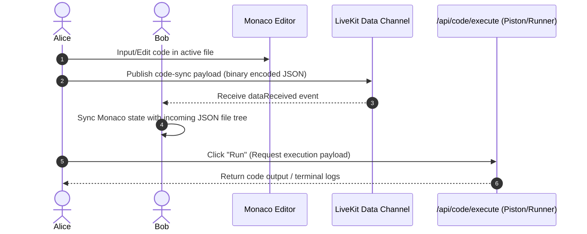
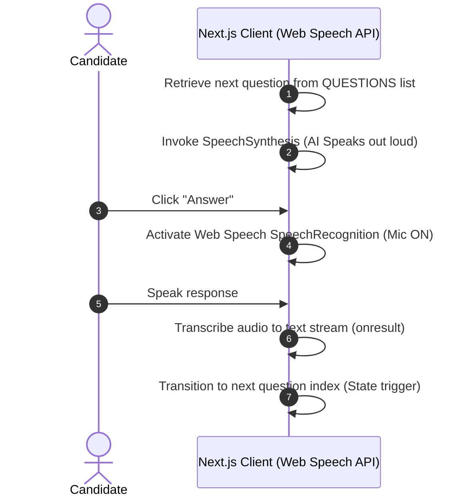
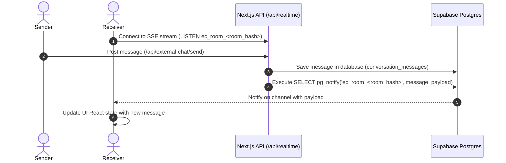

# 🧩 AIConnect: System Architecture & Workflow Document

This document provides a comprehensive overview of the **AIConnect** platform, detailing its architecture, tech stack, data design, and the runtime workflows that drive its collaboration and interview features.

---

## 🛠️ 1. Technical Stack

AIConnect is built with a modern, serverless-friendly, and highly interactive stack optimized for real-time engagement and low latency.



### 💻 Frontend (Client Side)
*   **Core Framework**: **Next.js 16 (App Router)** utilizing **React 19** and **TypeScript** for robust typing.
*   **Styling & UI**:
    *   **Tailwind CSS v4** for clean, utility-first layout styling.
    *   **Radix UI Primitives** (Accordion, Dialog, Tabs, Dropdowns, etc.) for accessible, headless interactive UI elements.
    *   **Framer Motion / Motion** for smooth, GPU-accelerated interface animations and transitions.
    *   **Lucide React** for modern, lightweight SVG icons.
*   **Interactive Components**:
    *   **Monaco Editor** (`@monaco-editor/react`) for full VSCode-like syntax highlighting, themes, and code editing features.
    *   **Sandpack React** (`@codesandbox/sandpack-react`) for containerized browser-based preview and execution of web code.
    *   **LiveKit React Components** (`@livekit/components-react`) for modular WebRTC participant video tiles, screenshare layout tracks, and room connection states.
*   **Speech Synthesis & Recognition**:
    *   **Web Speech API** (`SpeechRecognition` & `SpeechSynthesis`) for serverless voice interaction with the AI Interviewer.

### ⚙️ Backend (Server Side)
*   **Routing & APIs**: Next.js Server Components, API routes, and Route Handlers.
*   **Authentication**: **Clerk** (`@clerk/nextjs`) handling user session validation, JWT mapping, login, signup, and profile sync.
*   **Object Storage**: **AWS S3 / Compatible Storage** (`@aws-sdk/client-s3`) using **S3 Presigned URLs** for secure, direct-to-bucket uploads of user recordings, chat attachments, and generated media.
*   **Mailing Services**: **Nodemailer** and **Resend** for sending scheduled notifications and invite updates.
*   **AI Integrations**: **OpenAI SDK** (`openai`) driving interview evaluation, image generation, and chat helper functionalities.

### 🗄️ Database & Real-Time Sync
*   **Primary Database**: **PostgreSQL** hosted on **Supabase**.
*   **ORM**: **Prisma Client** with `@prisma/adapter-pg` for type-safe database queries. A custom compatibility layer maps legacy tables (`chatRoom` ➡️ `conversations`, `participant` ➡️ `conversation_members`, `chatMessage` ➡️ `conversation_messages`).
*   **Direct Access Pool**: Native `pg` Connection Pool for high-performance operations, like meeting scheduling queues.
*   **Real-time Communication**: Native **PostgreSQL LISTEN / NOTIFY** protocol (`pg_notify`) used for chat rooms and peer-to-peer signaling, eliminating the need for an external Redis layer or custom WebSocket servers.

---

## 🏗️ 2. Core System Architecture

AIConnect is structured around two main collaborative paradigms:
1.  **Peer-to-Peer Meetings & Collaboration**: Leveraging a WebRTC SFU (LiveKit) for media and data streams.
2.  **Workspace Collaboration & Chat**: Leveraging a PostgreSQL PubSub network for instant messaging and event propagation.

```
       ┌────────────────────────────────────────────────────────┐
       │                  Next.js App Router                    │
       │  (Pages: /dashboard, /meeting/[code], /external-chat)  │
       └───────────────────────────┬────────────────────────────┘
                                   │
         ┌─────────────────────────┼─────────────────────────┐
         ▼                         ▼                         ▼
 ┌───────────────┐         ┌───────────────┐         ┌───────────────┐
 │ Clerk Auth    │         │  LiveKit SFU  │         │   Postgres    │
 │ (Sessions &   │         │ (WebRTC Media │         │ LISTEN/NOTIFY │
 │ Webhooks)     │         │ & Data Sync)  │         │ (Chat PubSub) │
 └───────────────┘         └───────────────┘         └───────────────┘
```

### File & Folder Structure
```bash
├── app/                      # Next.js App Router directories
│   ├── (marketing)/          # Public landing/marketing pages
│   ├── api/                  # Serverless Route Handlers (Auth, Meetings, Code Execution, AI)
│   ├── auth/                 # Clerk-based authentication pages (Sign-in / Sign-up)
│   ├── dashboard/            # User Dashboard views (Overview, Schedule, AI, Chats)
│   │   ├── 3d-image-generator/
│   │   └── ai-interview/     # Interactive mock interview setup and live loop
│   ├── external-chat/        # Chat workspace view
│   └── meeting/              # Live Collaboration pages
│       ├── [code]/           # Live room interface (Video, Monaco Editor, Chat panels)
│       ├── create/           # Meeting scheduling UI
│       └── join/             # Lobby and code join interface
├── components/               # Reusable React components
│   ├── auth/                 # Auth-related layouts
│   ├── chat/                 # Meeting chat layouts
│   ├── dashboard/            # Sidebars and view switchers
│   ├── external-chat/        # Workspace chat threads, status feeds, call controllers
│   ├── meeting/              # LiveKit streams, Monaco Editor, Participant lists
│   └── ui/                   # Shared UI kit (buttons, inputs, tabs, dialogs)
├── lib/                      # Shared helper functions, databases, and SDK config
│   ├── prisma.ts             # Prisma client initialization & legacy model translation
│   ├── db.ts                 # pg Connection Pool for direct query triggers
│   ├── external-chat-realtime.ts # PostgreSQL LISTEN/NOTIFY wrapper
│   └── livekit-server.ts     # LiveKit token generator
└── services/                 # Business logic and external API communication layers
```

---

## 🔄 3. Key Structural Workflows

### 🔑 Workflow A: User Signup and Authentication Flow


*   **Details**: Clerk handles the sign-up and authentication lifecycle. The user's metadata is retrieved on the client via `useUser()`, and matching profiles are synced with the Postgres `users` table via API handlers.

---

### 📹 Workflow B: Scheduled Meeting & Live Lobby Workflow


*   **Lobby Security**: Guests must wait in a lobby. Next.js Route Handlers poll the database to verify when a host grants access.
*   **Media Connection**: Once approved, both host and guest receive unique JSON Web Tokens (JWT) generated via the `livekit-server-sdk` to authenticate directly with the LiveKit WebRTC SFU server.

---

### 💻 Workflow C: Collaborative VSCode-like Code Editor


*   **Editor Sync**: Changes in the Monaco editor trigger a debounced function that serializes the virtual directory file tree to a JSON payload. This payload is broadcasted instantly to all other users in the room using LiveKit's low-latency WebRTC data channels (`publishData` / `dataReceived`).
*   **Code Execution**: Code is compiled and run in a sandbox via a Next.js Serverless Route Handler, which forwards the code and execution instructions to a compiler API and returns the console stdout/stderr directly to the terminal component.

---

### 🎙️ Workflow D: AI Mock Interviewer Workflow


*   **Local Web Speech**: The AI Interviewer uses the browser's built-in `SpeechSynthesis` and `SpeechRecognition` engines. This provides responsive voice feedback and transcription without requiring heavy external cloud AI media API dependencies.

---

### 💬 Workflow E: Real-time Workspace Chat (PostgreSQL PubSub)


*   **Serverless PubSub**: Realtime synchronization utilizes PostgreSQL’s native notification system (`LISTEN/NOTIFY`).
*   **Lifecycle**: When a user registers a listener, the server keeps an open HTTP connection (Server-Sent Events) and executes `LISTEN` for that room code in Postgres. Whenever a message is sent, the server saves it in the DB and triggers a `NOTIFY`. Postgres immediately alerts all subscribed server instances, which push the events down to their corresponding client connections.

---

## 📐 4. Database Schema Design (Key Tables)

Below is an overview of the core PostgreSQL entities mapped in `schema.prisma`:

| Model Name | Table Name | Purpose | Key Relationships |
| :--- | :--- | :--- | :--- |
| `User` | `users` | Core user identity synced from Clerk. | Relations to files, workspaces, read receipts, and calls. |
| `Meeting` | `meetings` | Tracks individual meeting metadata and details. | Mapped to `Recording` and `MeetingNote`. |
| `meeting_rooms` | `meeting_rooms` | Persistent records of video rooms scheduled on the dashboard. | Has list of attendees (`MeetingRoomMember`). |
| `File` | `files` | Tracks collaborative files shared in rooms or workspaces. | Uploaded by `User`, resides in a `Conversation`. |
| `ExternalChatWorkspace`| `external_chat_workspaces`| High-level grouping of channels, direct chats, and members. | Built by `User`, houses many `Conversation` records. |
| `Conversation` | `conversations` | Repositories for group chat, private chat, or workspace channels.| Mapped to `ConversationMember`, `ConversationMessage`, `ExternalChatCallSession`. |
| `ExternalChatStatus` | `external_chat_statuses`| User stories/status updates (expire after 24h). | Has `ExternalChatStatusReaction`, `ExternalChatStatusComment`, `ExternalChatStatusView`. |
| `ExternalChatCallSession`| `external_chat_call_sessions`| Persistent logs of voice/video calls inside chat channels.| Links caller, receiver, and participant logs. |

---

## 🔒 5. Verification & Deployment Steps
1.  **Local Environment**: Copy environment templates (`cp .env.example .env`) and supply correct keys (`DATABASE_URL`, `NEXT_PUBLIC_CLERK_PUBLISHABLE_KEY`, `LIVEKIT_API_KEY`, `LIVEKIT_API_SECRET`).
2.  **Database Migration**: Run `pnpm prisma generate` to sync TS typings. Schema is applied to PostgreSQL by running `schema.sql` inside the Supabase SQL editor workspace.
3.  **Local Run**: Run `pnpm dev` to run the development server.
